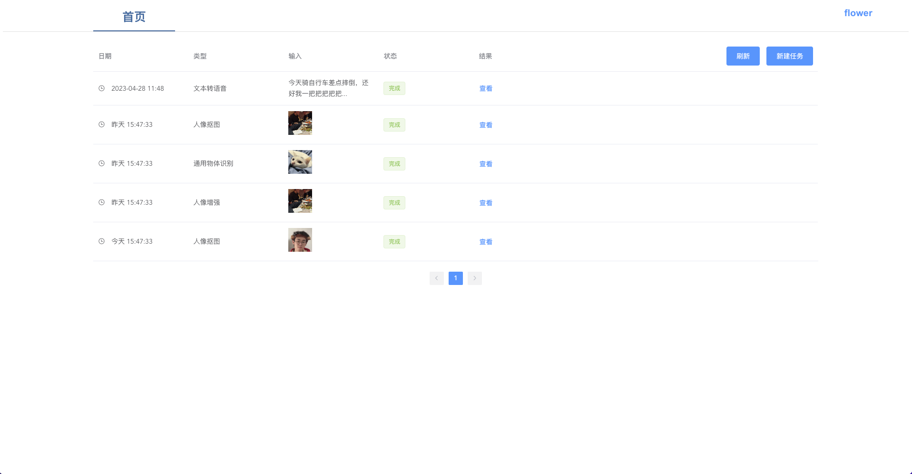
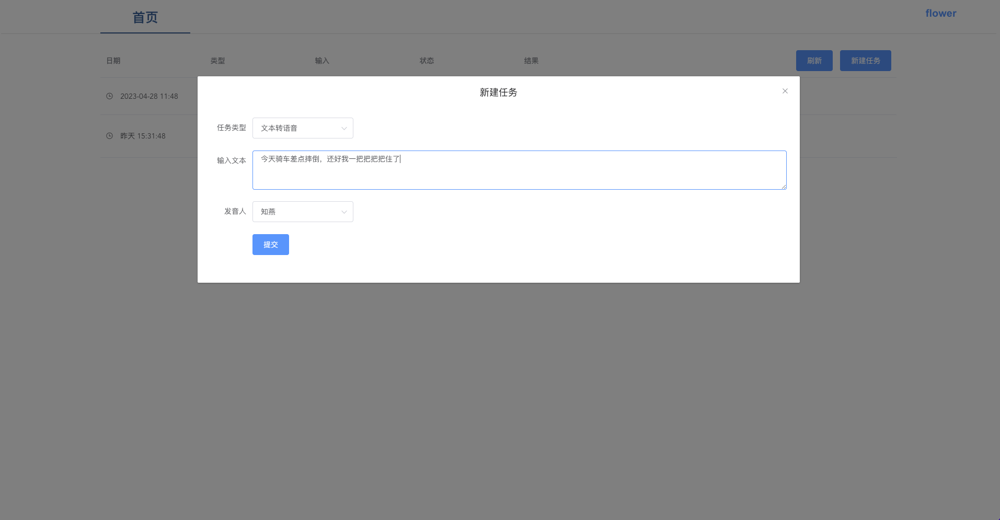
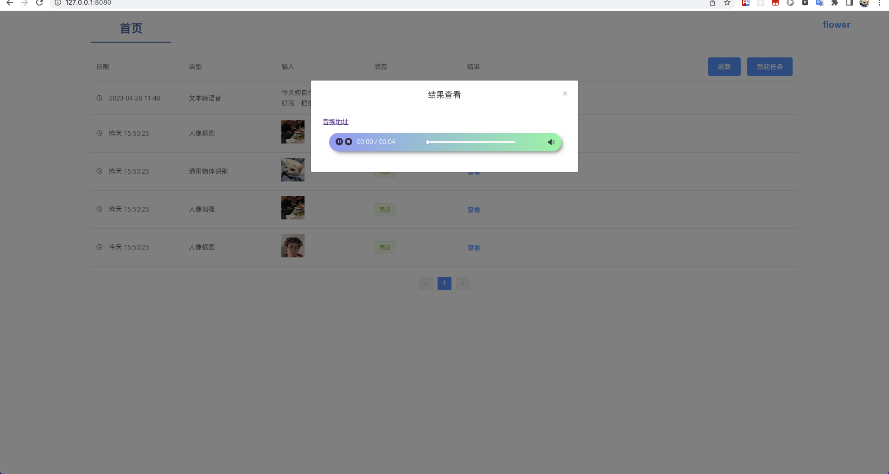
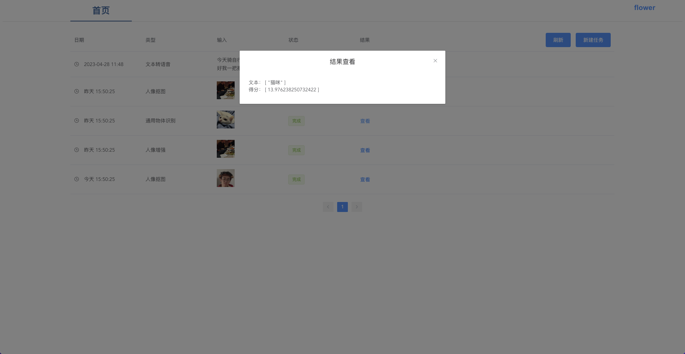
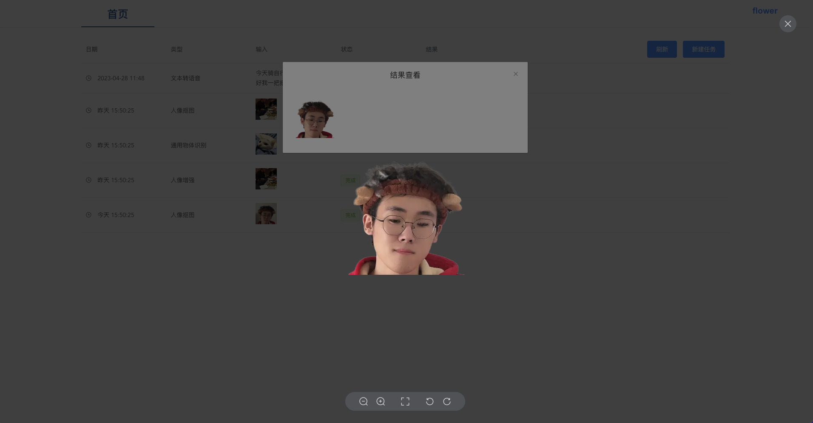

# modeltools

[魔搭コミュニティモデルライブラリ](https://modelscope.cn/models)
魔搭コミュニティから面白いモデルを入手して自分が使用する。タスクをキュー式にすると、小さな安いサーバーでも対応できる。

Webでタスクを作成すると、サーバーがCeleryを起動してコンシュームし、複数のサーバーで複数のコンシューマーを起動してタスクをコンシュームできる
nohupを使用してcron-start.shを起動できる
~~~shell
nohup sh cron-start.sh > cron.log 2>&1 &
~~~
## 環境設定
~~~shell
conda create -n modeltools
conda activate modelscope
# Jobを実行する必要がある場合
pip install torch torchvision torchaudio
pip install numpy==1.21.6
pip install tensorflow==1.15.0
pip install -r requirements.txt -f https://modelscope.oss-cn-beijing.aliyuncs.com/releases/repo.html # モデルjobの環境 Linux環境が必要

sh cron-start.sh

# Web環境
pip install -r web_requirements.txt

python manage.py runserver
~~~

## 追加済みのモデル
```markdown
- テキストから音声へ
	入力 テキスト
	出力 音声 .wav
- 人物画像切り抜き
	入力 画像
	出力 画像
- 人物画像強調
	入力 画像
	出力 画像
- 汎用物体認識
	入力 画像
	出力 テキスト、スコア
```

## Webプレビュー
[フロントエンドGithubリンク](https://github.com/flowerbling/modeltools-frontend)




