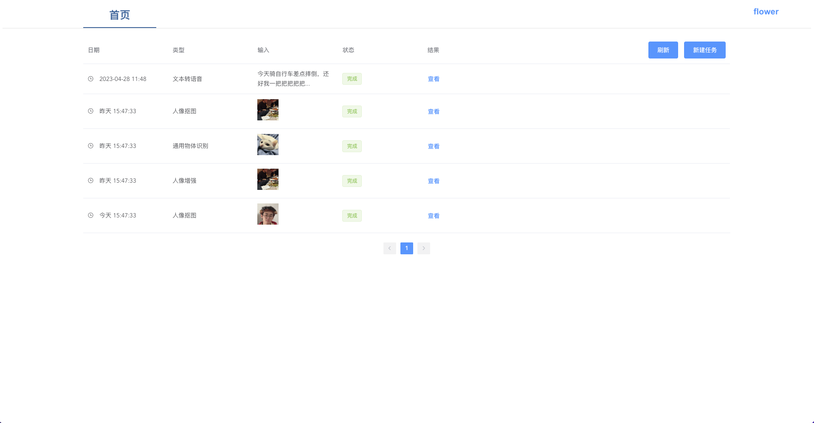
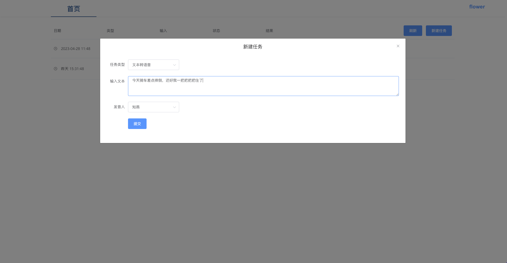
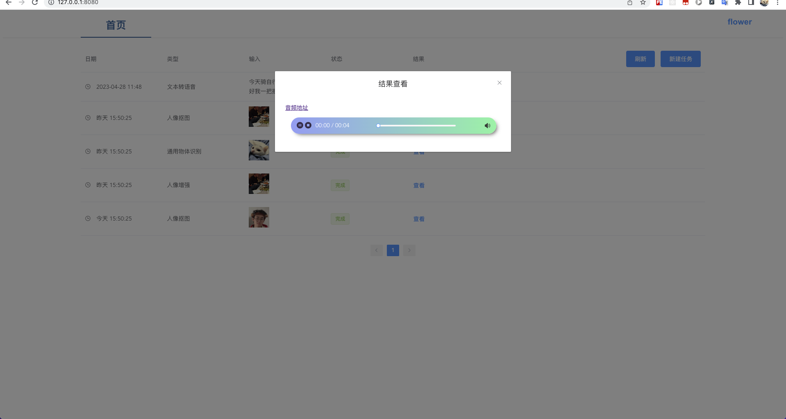
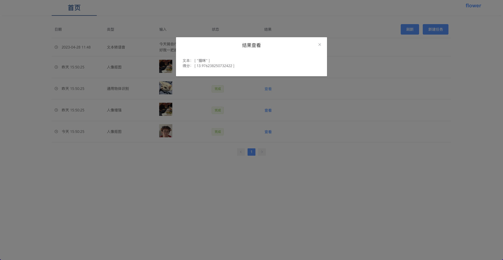

# modeltools

[魔搭社区模型库](https://modelscope.cn/models)
从魔搭社区里拿一些有意思的模型自己用。 任务做成队列式的，小垃圾服务器扛不住。

Web作为生产者
Celery作为消费者， 可以在多个服务器上启动多个消费者消费任务
可以使用nohup 启动 cron-start.sh
~~~shell
nohup sh cron-start.sh > cron.log 2>&1 &
~~~
## 环境配置
~~~shell
conda create -n modeltools
conda activate modelscope
# 如果需要跑Job
pip install torch torchvision torchaudio
pip install numpy==1.21.6
pip install tensorflow==1.15.0
pip install -r requirements.txt -f https://modelscope.oss-cn-beijing.aliyuncs.com/releases/repo.html # 跑模型job的环境 需要linux环境

sh cron-start.sh

# Web的环境
pip install -r web_requirements.txt

python manage.py runserver
~~~

## 已经添加的模型
```markdown
- 文本转语音
	输入 文本
	输出 音频 .wav
- 人像抠图
	输入 图片
	输出 图片
- 人像增强
	输入 图片
	输出 图片
- 通用物体识别
	输入 图片
	输出 文本， 得分
```

## Web预览
[前端Github链接](https://github.com/flowerbling/modeltools-frontend)




